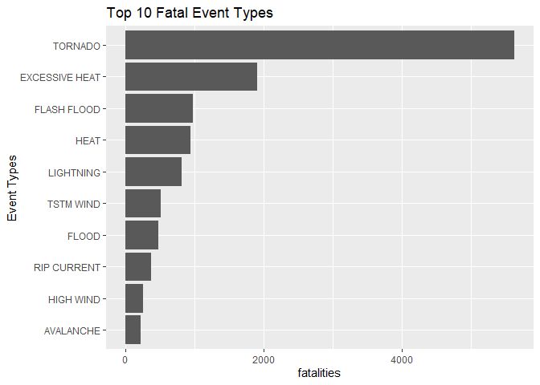
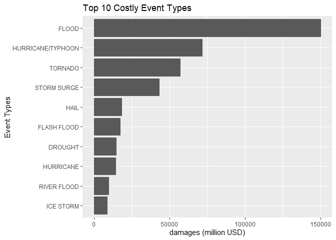

## Synopsis
This report analyse NOAA Storm Database to find out the Top 10 Event Types for the following:  
- fatal (most harmful with respect to population health)  
- costly (greatest economic consequences)  


## Load raw data

```r
raw <- vroom("repdata_data_StormData.csv.bz2")
```

```
## Rows: 902297 Columns: 37
```

```
## -- Column specification --------------------------------------------------------
## Delimiter: ","
## chr (18): BGN_DATE, BGN_TIME, TIME_ZONE, COUNTYNAME, STATE, EVTYPE, BGN_AZI,...
## dbl (18): STATE__, COUNTY, BGN_RANGE, COUNTY_END, END_RANGE, LENGTH, WIDTH, ...
## lgl  (1): COUNTYENDN
```

```
## 
## i Use `spec()` to retrieve the full column specification for this data.
## i Specify the column types or set `show_col_types = FALSE` to quiet this message.
```

## Data Processing
### Top 10 Fatal Event Types

```r
fatal <- raw %>%
  group_by(EVTYPE) %>%
  summarise(fatalities = sum(FATALITIES, na.rm = T)) %>%
  top_n(10, fatalities) %>%
  arrange(fatalities)

fatal$EVTYPE <- factor(fatal$EVTYPE, levels=fatal$EVTYPE)
```
Data transformations:  
- sum __FATALITIES__ into __fatalities__

### Top 10 Costly Event Types

```r
exp_tbl <- c("k" = 0.001, "m" = 1, "b" = 1000, "K" = 0.001, "M" = 1, "B" = 1000)

damage <- raw %>%
  group_by(EVTYPE) %>%
  summarise(pdamages = sum(PROPDMG * exp_tbl[PROPDMGEXP], na.rm = T),
            cdamages = sum(CROPDMG * exp_tbl[CROPDMGEXP], na.rm = T)) %>%
  mutate(damages = if_else(is.na(pdamages), 0, pdamages) + if_else(is.na(cdamages), 0, cdamages)) %>%
  top_n(10, damages) %>%
  arrange(damages)

damage$EVTYPE <- factor(damage$EVTYPE, levels=damage$EVTYPE)
```
Data transformations:  
- sum __PROPDMG__ into __pdamages__ with the consideration of __PROPDMGEXP__.  
- sum __CROPDMG__ into __cdamages__ with the consideration of __CROPDMGEXP__.  

## Results
### Top 10 Fatal Event Types

```r
ggplot(data=fatal, aes(x=fatalities, y=EVTYPE)) +
  ylab("Event Types") +
  labs(title="Top 10 Fatal Event Types") +
  geom_bar(stat="identity")
```

<!-- -->

The __TORNADO__ is the most harmful with respect to population
health with __5633__ fatalities.  
Followed by __EXCESSIVE HEAT, FLASH FLOOD, HEAT, LIGHTNING, TSTM WIND, FLOOD, RIP CURRENT, HIGH WIND, AVALANCHE__.

### Top 10 Costly Event Types

```r
ggplot(data=damage, aes(x=damages, y=EVTYPE)) + 
  xlab("damages (million USD)") +
  ylab("Event Types") +
  labs(title="Top 10 Costly Event Types") +
  geom_bar(stat="identity")
```

<!-- -->

The __FLOOD__ has the greatest economic consequences which
costed __150319.7__ million USD.  
Followed by __HURRICANE/TYPHOON, TORNADO, STORM SURGE, HAIL, FLASH FLOOD, DROUGHT, HURRICANE, RIVER FLOOD, ICE STORM__.
